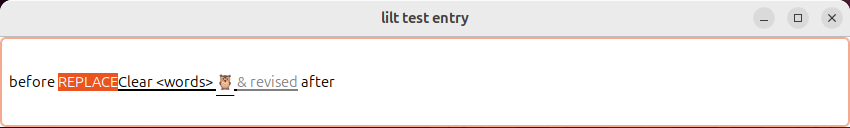

# lilt

Local voice typing for **Ubuntu 24.04, GNOME Shell 46, and x86-64**.
A C++ application handles audio and Whisper transcription; a small GNOME
extension handles shortcuts, the recording indicator, and text insertion.

[Source repository](https://github.com/w4term3loon/lilt) · [Roadmap](docs/roadmap.md)



The screenshot uses synthetic text. Composition styling varies by application.

## Use

1. Focus a text field.
2. Press **Ctrl + Super + Space** and speak.
3. Press **Enter** to finish, or **Escape** to discard the recording.

Enter finishes dictation without submitting the field. Pressing Start again also
finishes. Set Start, Finish, the model, and Live text in Preferences, available
from the top-bar microphone or the **lilt** application launcher.

Nine rounded bars respond to your voice; three bouncing dots indicate final
processing. Preferences keeps the four controls in a compact, centered layout.
Draft text requests muted green without an underline. GTK's IBus input module
honors these styles; Chromium and GNOME's native Wayland path can override them.

Audio stays in memory. There is no cloud transcription, telemetry, clipboard
access, or recording history. Models download only on request; dictation then
works offline. The default microphone comes from Ubuntu Sound settings.

## Install

Clone the repository and install from the source checkout:

```bash
sudo apt install build-essential git cmake pkg-config libgtk-3-dev libpulse-dev python3 binutils
git clone https://github.com/w4term3loon/lilt.git
cd lilt
./scripts/build.sh
python3 scripts/install.py
```

The installer adds `~/.local/bin/lilt`, its desktop launcher, D-Bus service, and
GNOME extension. **Log out and back in once** so GNOME loads the new extension.
Open Preferences to download a model. To use an extracted native release archive,
run its `python3 scripts/install.py`; compilation is unnecessary.

The native application and extension must both be installed. Only GNOME 46 is
supported. The extension ID is `lilt@local`.

Updates require a new login to reload extension JavaScript. Existing PTT settings
and models migrate on first launch without overwriting lilt files or deleting
old data. The installer disables the old extension to avoid shortcut conflicts.

## Models and limits

All models support **English dictation** and run on the CPU.

| Model | Parameters | Download | Tradeoff |
| --- | ---: | ---: | --- |
| Tiny English Q5_1 | 39 million | 30.7 MiB | Smallest footprint |
| Base English Q5_1 | 74 million | 57.0 MiB | Faster recognition |
| Small English Q5_1 | 244 million | 181.3 MiB | Default quality/size balance |
| Medium English Q5_0 | 769 million | 514.2 MiB | Larger, slower alternative |

Original weights come from [OpenAI Whisper](https://github.com/openai/whisper#available-models-and-languages).
The app downloads converted, quantized files from
[ggerganov/whisper.cpp](https://huggingface.co/ggerganov/whisper.cpp/tree/98aa99a0a9db05ae2342309f5096248665f7cba3).

Downloads use a pinned revision, size, and SHA-256 digest and are installed
atomically. Download size is not runtime memory. Settings live in
`~/.config/lilt/config.ini`; models in `~/.local/share/lilt/models`. XDG overrides
are respected.

Live text revises the draft until Finish. Keep the target field focused: changing
fields or closing the window cancels dictation. Password/PIN fields are excluded.
For applications without compatible composition support, turn off **Live text**.
Failed final insertion leaves selectable recovery text in Preferences until the
next recording or application exit. Recordings are limited to three minutes.
Review recognized text before sending it.

## Test without logging out

`./scripts/build.sh` runs the available core tests. Install the full test tools
and run the desktop test with:

```bash
sudo apt install gjs gir1.2-gtk-3.0 gir1.2-ibus-1.0 xvfb dbus-x11 python3-gi
./scripts/build.sh
bash extension/tests/headless-smoke.sh wayland
```

The desktop test uses a separate GNOME session and synthetic transcripts. It
checks real text insertion without opening the microphone or changing the active
desktop. Use `ibus` or `x11` instead of `wayland` to exercise the other supported
input paths. See [CONTRIBUTING.md](CONTRIBUTING.md) for coverage and development.

## Releases and removal

```bash
python3 scripts/package.py --output dist
```

This creates a native Ubuntu 24.04 x86-64 archive, an extension ZIP, a matching
source archive with pinned whisper.cpp source, and checksums. Models and system
libraries are excluded. Release builds use baseline x86-64 instructions; use
`./scripts/build.sh -DGGML_NATIVE=ON` only for a locally optimized executable.

To remove lilt while keeping settings and models:

```bash
python3 ~/.local/share/lilt/uninstall.py
```

Add `--purge-data` to remove lilt's settings and models too. Legacy PTT files are
preserved. For custom installation paths, see [CONTRIBUTING.md](CONTRIBUTING.md).

## Troubleshooting

- **No icon:** check GNOME's version, log in again, and enable lilt in Extensions.
- **Service unavailable:** run `~/.local/bin/lilt` to see the application error.
- **No audio:** check the default microphone in Ubuntu Sound settings.
- **No live text:** disable Live text and retry in the same application.
- **Shortcut conflict:** choose a different Start shortcut in Preferences.

For reports, include `lilt --version`, GNOME version, session type, model,
application, and reproduction steps. Remove private text from logs/screenshots.

## License

Copyright © 2026 lilt contributors. Licensed under **GPL-3.0-or-later**, without
warranty. See [LICENSE](LICENSE), [third-party notices](THIRD_PARTY_NOTICES.md),
and [CHANGELOG.md](CHANGELOG.md).
